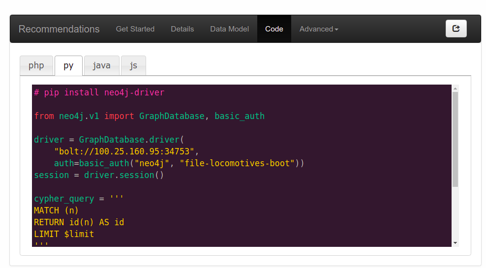
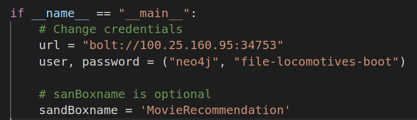

# Graph Database Explore
Explore capacity of Neo4J and Graph Database

### How to run import data to Neo4J
1. Install python from source: https://www.python.org/downloads/mac-osx/
2. Clone / downloads the project
3. Create a virtual environment:
    ```bash
    python3 -m venv myenv
    ```
    Activate the environment
    ```bash
    source myenv/bin/activate
    ```
4. Install library requirements from requirements.txt
    ```bash
    pip install -r requirements.txt
    ```
5. Start Neo4J database, create a new user: root and password: root. Set role as admin
6. Modify the folder path in the main function
7. Run the program
    ```bash
    python GraphDatabaseFromFile.py
    ```

### How to run extract data from SandBox Neo4J
1. Install python, clone project and create all virtual environment.
2. Create a Neo4J Sandbox https://neo4j.com/sandbox-v2/#
3. Obtain the credentials for python: We will need "bolt://..." as URL, "neo4j" as username and "file-locomotives-boot" as password

    

4. Modify source code of connectSandBox.py

    
5. Execute python file as usual

### Reference
1. Neo4J CheatSheet: https://neo4j.com/docs/cypher-refcard/current/?ref=browser-guide
